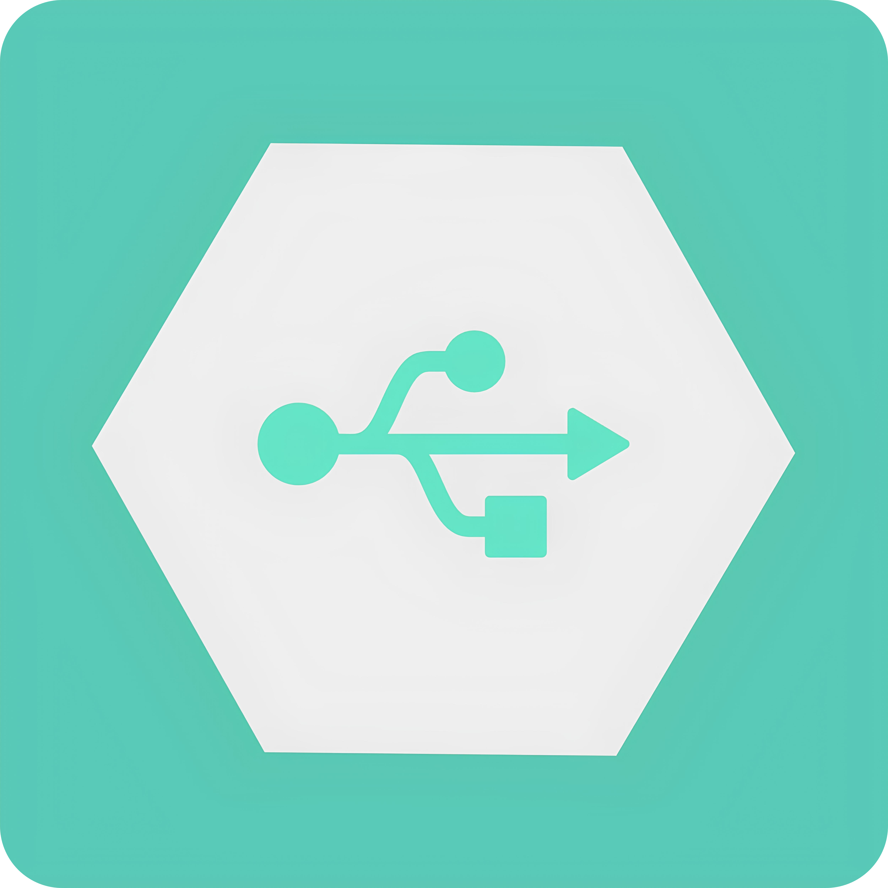

# Cortex

## 📘 Overview
An open-source USB-driven cloud storage and development platform for seamless integration and synchronization.

> [!CAUTION]
> The features are not currently added and this project is in-dev!

## 🚀 Features
- **USB-Driven Cloud Sync:** Automatically sync data between USB devices and cloud storage for seamless access across multiple platforms.
- **Cross-Platform Development Environment:** Develop directly from your USB with a fully integrated cloud-based environment for team collaboration.
- **Instant Workspace Setup:** Plug in your USB, and Cortex automatically sets up a personalized development workspace with all necessary tools and configurations.
- **Secure & Private:** All data is securely stored and synchronized, ensuring privacy and data integrity across devices.
- **Real-Time Collaboration:** Easily collaborate with teammates in real time, with changes syncing instantly across all devices.
- **Automated Version Control:** Automatically sync your changes, and manage project versions seamlessly between your local USB storage and cloud.

## 🔧 Prerequisites
Before getting started with Cortex, make sure you have the following:

- **Supported OS:** Linux (only).
- **USB Device:** Any USB drive with at least 8 GB of available storage.
- **Required Software:**
    - C++ Compiler (GCC)
    - CMake (for building the project)
    - Git (for version control)
- **Internet Connection:** Required for cloud synchronization and remote collaboration features.
- **Cloud Account:** Register for the Cortex cloud platform to enable storage and collaboration features.

## 💾 Installation

### Quick Start
[coming soon]

## 🧪 Development

### Building

To build the project from source, follow these commands:
```bash
# Clone the repository
git clone https://github.com/mkaksoy/Cortex.git

# Navigate into the project directory
cd Cortex

# Create a build directory and navigate into it
mkdir build && cd build

# Run CMake to configure the project
cmake ..

# Build the project
make
```

### Testing

To run the tests for the project, use the following command:
```bash
make test
```

### Contributing
See [CONTRIBUTING.md](CONTRIBUTING.md) for contribution guidelines.

## 📜 License
This project is licensed and available under [PolyForm Shield 1.0.0](LICENSE.md) license.
> [!IMPORTANT]
> Commercial use is prohibited. See full license for details.

## 🔗 Technologies

|        | **for core functionality** |
|-------------------------------------------------------|----------------------------|
|    | **for building project**   |
|    | **for development**        |
|  | **for containerization**   |
|        | **for version control**    |


## 📞 Support
- Issue tracker: [Link](https://github.com/mkaksoy/Cortex/issues)
- Contact: [mkaksoy@protonmail.com](mailto:mkaksoy@protonmail.com)

## 📊 Project Status
**Alpha Stage:** The core functionality is under active development. Major features are being integrated, and testing is ongoing.